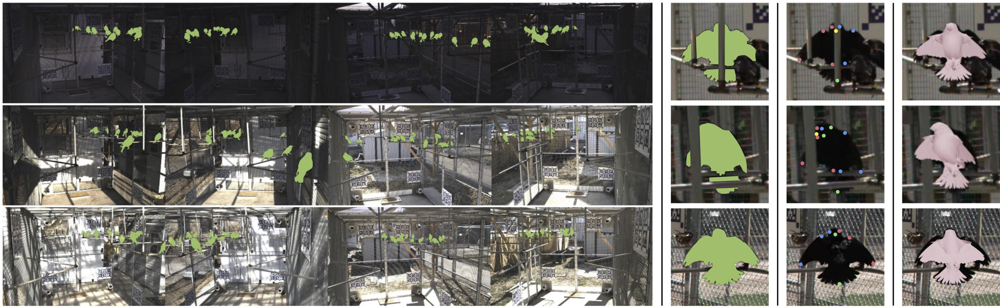

********* Project Guide**********
# avian-mesh
Code repository for the paper: \
**3D Bird Reconstruction: a Dataset, Model, and Shape Recovery from a Single View**  
[Marc Badger](https://www.ocf.berkeley.edu/~badger/), [Yufu Wang](https://yufu-wang.github.io), [Adarsh Modh](https://www.seas.upenn.edu/~adarshm/), [Ammon Perkes](https://aperkes.github.io), [Nikos Kolotouros](https://www.seas.upenn.edu/~nkolot/), [Bernd Pfrommer](http://pfrommer.us), [Marc Schmidt](https://web.sas.upenn.edu/marcschmidtlab/pages/people/), [Kostas Daniilidis](https://www.cis.upenn.edu/~kostas/) \
ECCV 2020 \
[[Project Page](https://marcbadger.github.io/avian-mesh/)]



## Installation instructions
```
virtualenv avian3d -p python3
source avian3d/bin/activate
pip install -U pip
pip install -r requirements.txt
```

In addition, you will need to install [pytorch3D](https://github.com/facebookresearch/pytorch3d). Please follow the installation instructions, and we recommend installing with CUDA support if you want to utilize silhouettes in single view reconstruction. If you need offscreen rendering (e.g. over SSH), please look at these [instructions](https://pyrender.readthedocs.io/en/latest/install/index.html) for installing pyrender with OSMesa. 

## Fetch data
Download the [cowbird dataset](https://drive.google.com/file/d/1vyXYIJIo9jneIqC7lowB4GVi17rjztjn/view?usp=sharing) and place it under `/data`. To run our pipeline, you will also need to download the pretrained [keypoint detector](https://drive.google.com/file/d/17hhoGypVQWOwhSEacHO_GVwAmL6UB3PS/view?usp=sharing) and place it in `/keypoint_detection`. If you want to try our MaskRCNN-based detector, download the finetuned [weights](https://drive.google.com/file/d/1YrDNJNEdbMgHjmiA2go6yOB3hEiXxw8V/view?usp=sharing) into `/models`; this step is not required for reconstruction. 

## Dataset format
Within cowbird, most labels are kept in [COCO](https://cocodataset.org/#format-data) format. Each image has a unique image id, which is also the name of that image. All annotations are stored in `/cowbird/annotations/instance.json`, including over 6355 segmented instances, a subset of which (about 1000) will also have keypoints. You will also find information regarding the exact ROS time and the camera from which it is captured. Beyond `instance.json`, we split the group of instances that have keypoint annotaitons into `instance_train.json` and `instance_test.json` for single view reconstruciton task. In the `instance_splits` folder, you will also find datasets split by different criteria (e.g. by season); these splits and labels can be used for instance level detection and tracking tasks. You can take a look at `datasets/cowbird_dataset.py` as a quick guide in how to read the labels. 

The only labels not in COCO format are in `/cowbird/annotations/multiview_instance.pth`, which contains instances that have multiview matching. These are used to recover a pose prior. We provide a dataset class `datasets/multiview_dataset.py` as a starting point to take advantage of these multiview data. 


## Run demo code
We provide demo codes for singleview reconstruction, multiview reconstruction, and a pretrained detector based on Mask R-CNN. The demo codes use the provided dataset classes describe above to load the cowbird dataset. 

Demo for single view reconstruction with only keypoints
```
python tools/singleview_demo.py
```
or reconstruction with keypoints and silhouette
```
python tools/singleview_demo.py --use_mask
```

Demo for instance level detection
```
python tools/detector_demo.py
```

## Run evaluation code
In addition to the demo code, we also provide evaluation codes for reconstruction and keypoint detection. The script `tools/eval_sv.py` will run complete single view reconstruciton on all instances in `instance_test.json` and evalutate IoU and PCK.  The script `eval_cv.py` runs a cross view evaluation of single view reconstruction, using instances that have multiview access `multiview_instance.pth`. For each instance, from each view, it will run reconstruction, perform global rigid alignment, and evaluate on non-source views.

Example usage:
```
python tools/eval_sv.py --use_mask
```

## Citing
If you find this dataset and code useful for your research, or use data generated by our model, please consider citing the following paper:

	@Inproceedings{badger2020,
	  Title          = {3D Bird Reconstruction: a Dataset, Model, and Shape Recovery from a Single View},
	  Author         = {Badger, Marc and Wang, Yufu and Modh, Adarsh and Perkes, Ammon and Kolotouros, Nikos and Pfrommer, Bernd and Schmidt, Marc and Daniilidis, Kostas},
	  Booktitle      = {ECCV},
	  Year           = {2020}
	}


